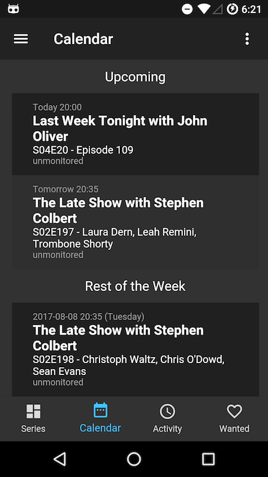

# Submarine
#### Sonarr Companion App

Submarine is a Mobile (Android, iOS, and Andromeda) companion App for Sonarr. It aims to offer a nice user experience and a wide set of functionalities.

[Download](https://play.google.com/store/apps/details?id=co.starcarr.sonarr.submarine) in the Play Store

## Features
Version 1.0 supports the current functionalities:

 - Add/Edit/Delete series
 - Search for episodes manually
 - Trigger automatic search
 - Monitor seasons/episodes
 - See the upcoming episodes
 - Check the queue of the server, displaying the quality of the download, remaining time, etc
 - See the history of grabs, imports, deletions, etc
 - Delete downloaded files
 - See the wanted/missing episodes and trigger search or manual download easily
 - Use SSL even with self-signed certificates
 - Others

## Screenshots

Here are some screenshots:

## Video

Here's a video of version 1.0:

## Contact
Feel free to create issues for feature requests/bugs. If you want to reach me please email <submarine@starcarr.co>.

## Links
 * [Download](https://play.google.com/store/apps/details?id=co.starcarr.sonarr.submarine)
 * [Sonarr](https://sonarr.tv/)
 
